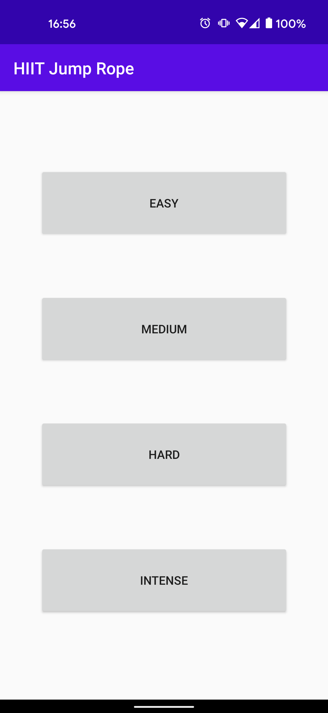
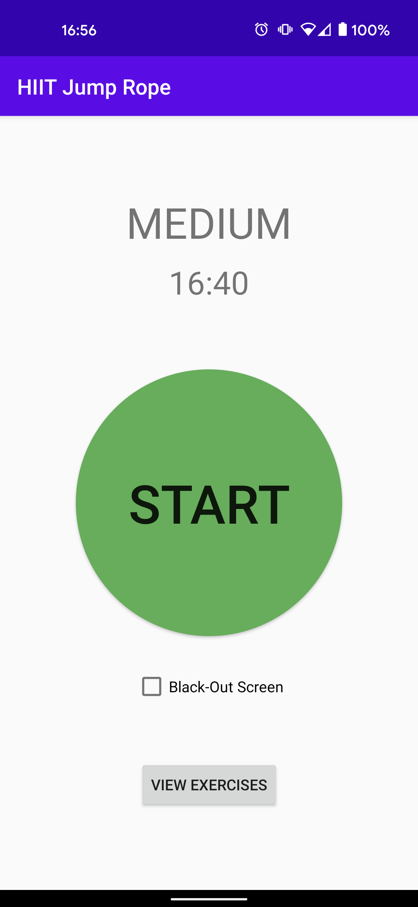
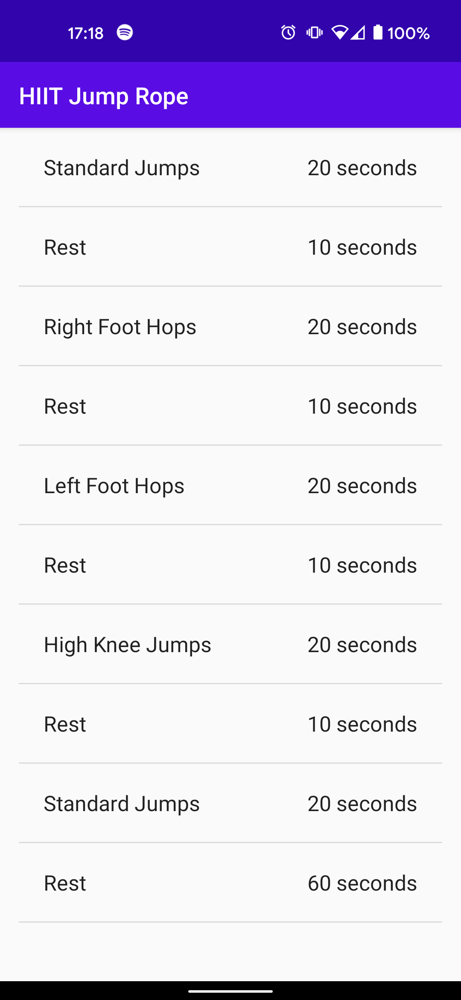
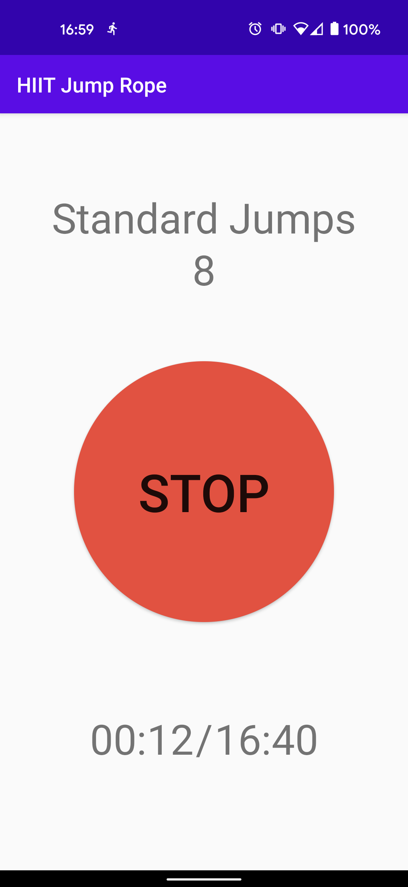
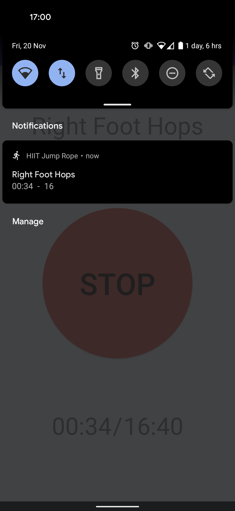
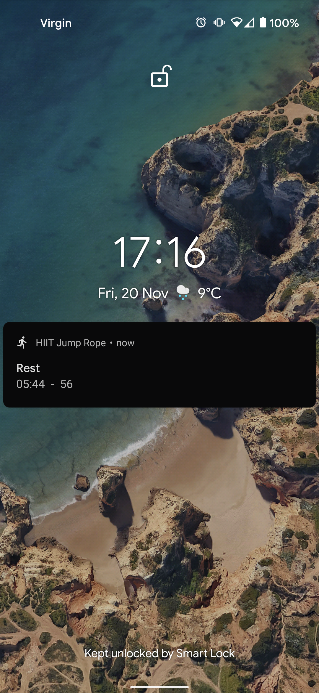
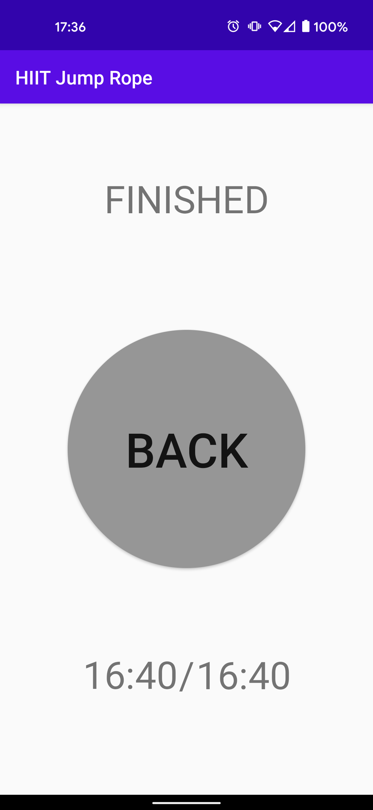

# HIITJump

An Android application to help keep track of a High-Intensity Interval Training (HIIT) jump-rope workout.

## Screenshots

<table style="padding:10px">
  <tr>
    <td><strong>Homescreen</strong></td>
    <td><strong>Start Screen</strong></td>
    <td><strong>Exercise List</strong></td>
    <td><strong>Active Screen</strong></td>
  </tr>
  <tr>
    <td> 
      
    </td>
    <td>
      
    </td>
    <td>
     
    </td>
    <td>
      
    </td>
  </tr>
  
  <tr>
    <td><strong>Pulldown Notification</strong></td>
    <td><strong>Lockscreen Notification</strong></td>
    <td><strong>Blackout Mode</strong></td>
    <td><strong>Finished Screen</strong></td>
  </tr>
  <tr>
    <td> 
      
    </td>
    <td>
      
    </td>
    <td>
     
    </td>
    <td>
      
    </td>
  </tr>
</table>

## APK

You can download an APK for this application [here](./demo/app-debug.apk).\
(This is not a signed APK, it is just the debug version)

----
N.B. I am not an Android developer. This project is used as a learning exercise.
